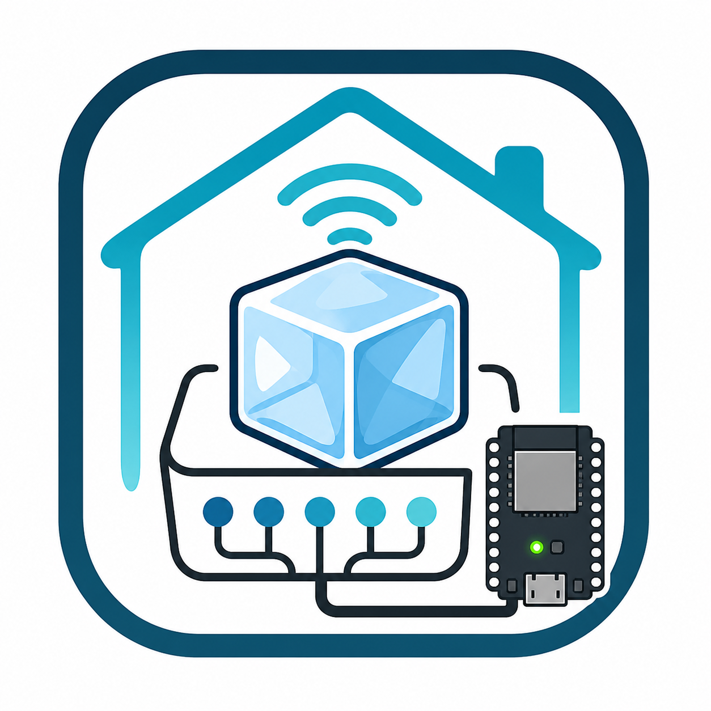
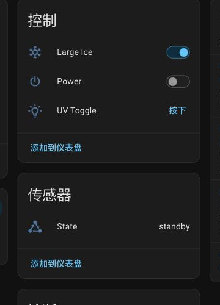
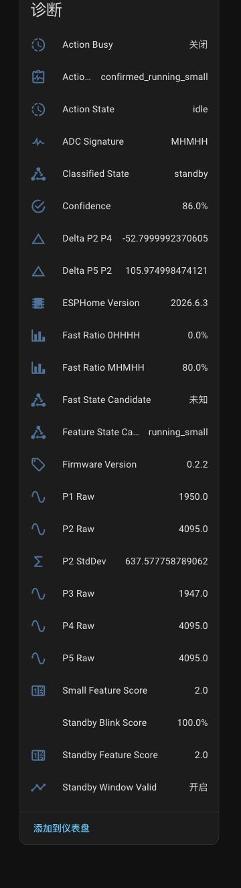
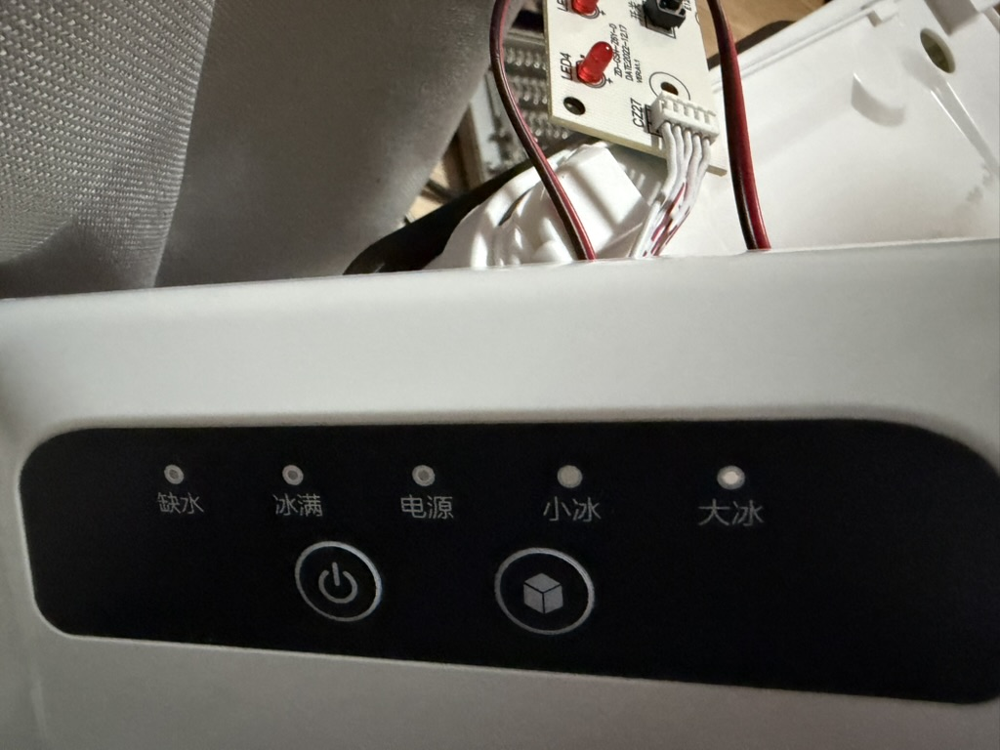
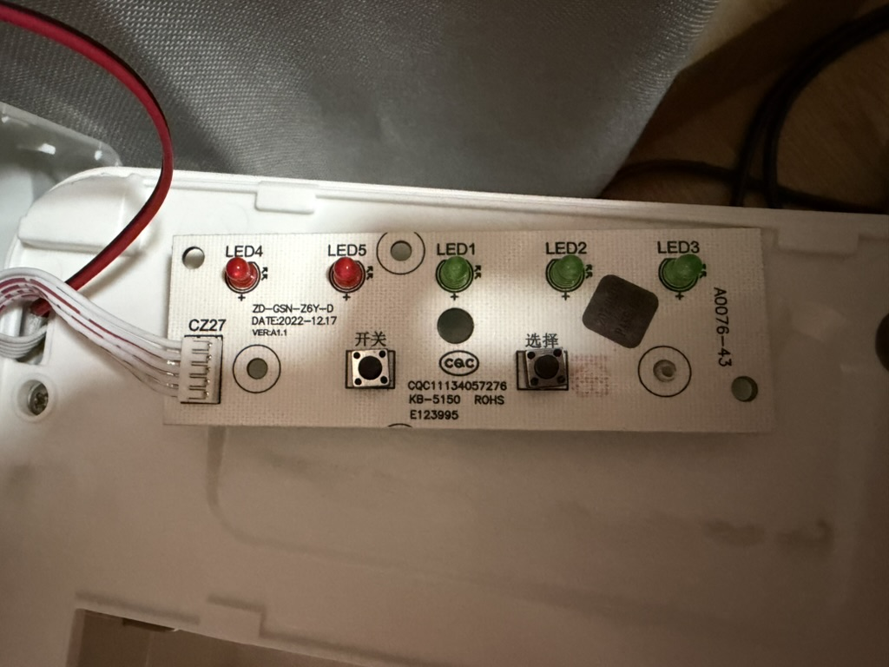
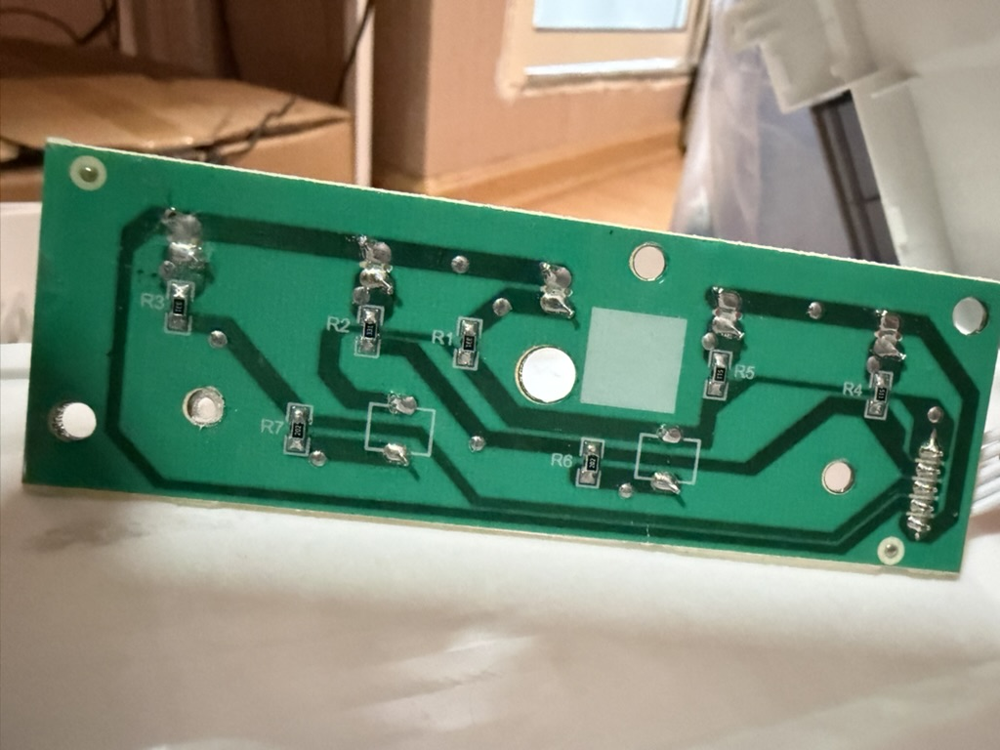
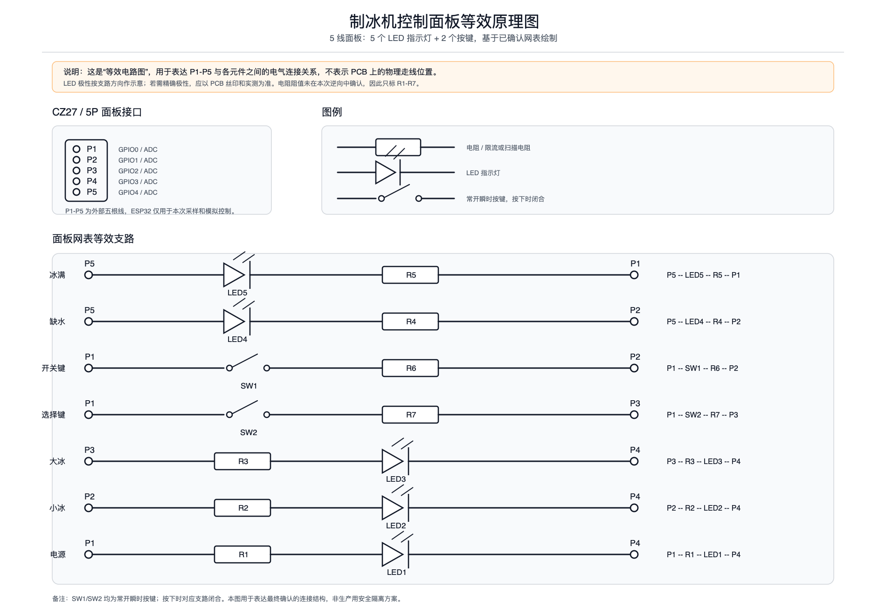
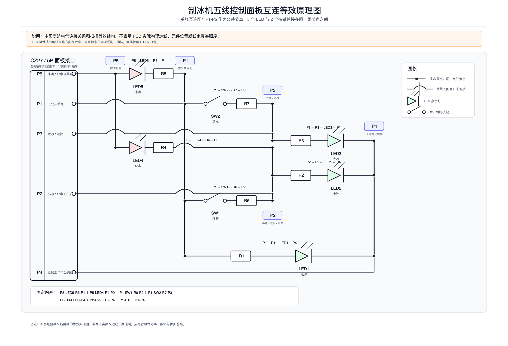
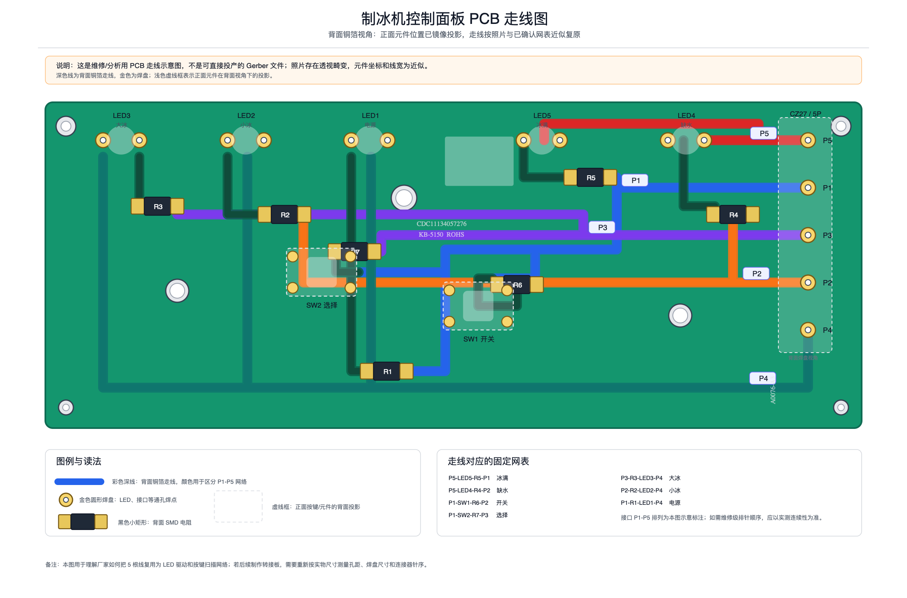

# ChangHongIceMakerESPHome

<p align="center">
  
</p>

语言：中文 | [English](README.en.md)

把长虹 `CH-Z6Y3` 制冰机接入 Home Assistant 的 ESPHome 固件。ESP32-C3 连接原机 5 线控制面板后，可以在 HA 中查看运行状态、开关制冰、切换大小冰，并触发 UV 杀菌按键。

> 当前方案是实测可用的直连 GPIO 改造，不是通用安全电气接口。长期使用建议增加串联限流、电平钳位或隔离前端。

## 适配范围

| 项目 | 说明 |
| --- | --- |
| 已验证机型 | 长虹 `CH-Z6Y3` |
| 控制板 | 原机 5 线 `P1-P5` 面板 |
| 指示灯 | `缺水`、`冰满`、`电源`、`小冰`、`大冰` |
| 按键 | `开关`、`选择` |
| 主控芯片 | ESP32-C3 Super Mini 或兼容 ESP32-C3 开发板 |
| Home Assistant 接入 | ESPHome Native API |

其它型号即使外观看起来相同，也需要先确认 `P1-P5` 网表、按键/LED 支路、启动后默认进入大冰的行为，以及待机/小冰/大冰的 ADC 特征。

## 效果

Home Assistant 中会出现：

| 实体 | 用途 |
| --- | --- |
| `Power` | 运行/待机 |
| `Large Ice` | 大冰/小冰。待机时固定显示大冰，因为机器每次从待机启动都会先进入大冰 |
| `UV Toggle` | 模拟长按“选择”键，开启或关闭 UV 杀菌 |
| `State` | `standby`、`running_large`、`running_small`、`starting`、`stopping`、`unknown` |

<details>
<summary>查看 Home Assistant 页面截图</summary>





</details>

## 外观和面板



<details>
<summary>查看面板 PCB 照片</summary>





</details>

## 安装硬件

准备：

- ESP32-C3 Super Mini 或兼容开发板
- 普通两脚 USB-C 电源适配器或充电宝
- 细导线、万用表、绝缘材料

接线：

```text
P1 -> GPIO0
P2 -> GPIO1
P3 -> GPIO2
P4 -> GPIO3
P5 -> GPIO4
```

接线要求：

- 制冰机断电后等待至少 30 秒再接线。
- 不连接制冰机 GND 到 ESP32-C3 GND。
- ESP32-C3 单独用 USB 供电，不从面板取电。
- 不要在制冰机通电时插拔 `P1-P5`。
- 不要让裸线、焊点或 ESP32-C3 背面接触金属件。
- 如果 `P3 -> GPIO2` 后 ESP32-C3 无法启动，可把 P3 改接 GPIO5，并同步修改固件引脚映射。

供电方式很关键。已接入 `P1-P5` 后，日常运行建议使用两脚 USB-C 适配器或充电宝。不要同时把 ESP32-C3 接到电脑 USB，电脑地参考可能扰乱面板扫描，导致状态识别异常或原面板按键失效。必须看 USB 串口时，使用 USB 隔离器；更推荐用 Wi-Fi 日志和 OTA。

## 刷机

建议在 ESP32-C3 未连接制冰机时完成首次刷机。

### 首选：使用 Release 固件

普通用户建议直接使用 GitHub Release 中已经构建好的固件，不需要安装 ESPHome 或本地编译。

1. 打开 [Latest Release](https://github.com/Ljzd-PRO/chang_hong_ice_maker_esphome/releases/latest)。
2. 下载 `chang-hong-ice-maker-esphome.factory.bin`。
3. 使用支持 Web Serial 的 Chrome 或 Edge 打开 `https://web.esphome.io/`。
4. 连接 ESP32-C3，选择本地 `factory.bin` 文件刷入。
5. 刷机完成后断开 USB，再按“配网”章节让设备接入家庭 Wi-Fi。

如果 ESPHome Web 不可用，也可以使用 `esptool.py` 刷入：

```sh
python3 -m pip install esptool
esptool.py --chip esp32c3 --port /dev/cu.usbmodemXXXX --baud 460800 \
  write_flash 0x0 chang-hong-ice-maker-esphome.factory.bin
```

Release 中常见文件用途：

| 文件 | 用途 |
| --- | --- |
| `chang-hong-ice-maker-esphome.factory.bin` | 首次 USB/串口刷机，普通用户首选。 |
| `chang-hong-ice-maker-esphome.ota.bin` | 后续 OTA 更新镜像，适合支持 ESPHome OTA 二进制上传的工具。 |
| `chang-hong-ice-maker-esphome.bin` | 原始固件镜像，普通用户通常不用。 |
| `chang-hong-ice-maker-esphome.build_info.json` | 构建元数据。 |
| `SHA256SUMS` | 文件校验和。 |

Release 固件使用公开固定凭据，便于用户直接刷机和配网：

```yaml
fallback_ap_password: "ci-fallback-password"
api_encryption_key: "AAECAwQFBgcICQoLDA0ODxAREhMUFRYXGBkaGxwdHh8="
ota_password: "ci-ota-password"
```

这些值是公开的。只在可信家庭网络中使用通常足够方便；如果你希望使用私有 API key 和 OTA 密码，请按下面的源码方式自行编译刷机。

### 高级：从源码编译刷机

开发者或需要私有密钥的用户可以从源码编译。

安装 ESPHome：

```sh
python3 -m venv .venv-esphome
.venv-esphome/bin/pip install esphome
```

准备密钥：

```sh
cp secrets.example.yaml secrets.yaml
```

编辑 `secrets.yaml`，并用下面的命令生成自己的 API encryption key：

```sh
openssl rand -base64 32
```

检查、编译并首次 USB 刷机：

```sh
ls -1 /dev/cu.usb* /dev/tty.usb*
.venv-esphome/bin/esphome config chang-hong-ice-maker-esphome.yaml
.venv-esphome/bin/esphome compile chang-hong-ice-maker-esphome.yaml
.venv-esphome/bin/esphome run chang-hong-ice-maker-esphome.yaml --device /dev/cu.usbmodemXXXX
```

源码方式的后续 OTA：

```sh
.venv-esphome/bin/esphome upload chang-hong-ice-maker-esphome.yaml --device chang-hong-ice-maker-esphome.local
```

## 配网

支持三种方式：

1. 预写 Wi-Fi：从源码编译时，可以在 `secrets.yaml` 中写入 Wi-Fi 后刷机。
2. Fallback AP：设备连不上 Wi-Fi 约 90 秒后，连接 `ChangHongIceMakerESPHome AP`，打开 `http://192.168.4.1/` 配网。
3. BLE Improv：设备连不上 Wi-Fi 约 90 秒后，用支持 Web Bluetooth 的 Chrome/Edge 打开 `https://www.improv-wifi.com/`，选择 `chang-hong-ice-maker-esphome` 配网。

使用 Release 固件时，通常使用 Fallback AP 或 BLE Improv 配网；Fallback AP 密码是 `ci-fallback-password`。

蓝牙只用于配网，日常控制走 Wi-Fi 上的 ESPHome Native API。固件会把成功连接的 Wi-Fi 凭据保存到固定位置，OTA 更新后不应丢失配网。

## 添加到 Home Assistant

1. 确认 ESP32-C3 和 Home Assistant 在同一局域网。
2. 打开 `Settings -> Devices & services`。
3. 如果自动发现 `Chang Hong Ice Maker ESPHome`，直接添加。
4. 如果没有自动发现，手动添加 `ESPHome` 集成。
5. Host 填 `chang-hong-ice-maker-esphome.local` 或 ESP32-C3 的 IP。
6. 如果使用 Release 固件，输入公开固定 key：`AAECAwQFBgcICQoLDA0ODxAREhMUFRYXGBkaGxwdHh8=`。
7. 如果是源码自编译固件，输入你自己的 `secrets.yaml` 中的 `api_encryption_key`。

主实体：

```text
switch.chang_hong_ice_maker_esphome_power
switch.chang_hong_ice_maker_esphome_large_ice
button.chang_hong_ice_maker_esphome_uv_toggle
sensor.chang_hong_ice_maker_esphome_state
```

如果同一块 ESP32-C3 曾经刷过旧固件，HA 可能保留旧实体。可以在 HA 中手动改名，或删除旧 ESPHome 设备后重新添加。

## 使用

### 开机制冰

打开 `Power`。机器从待机启动后会进入大冰模式，因此 `Large Ice` 会保持打开。

### 切换大小冰

机器运行时切换 `Large Ice`：

- 开：大冰
- 关：小冰

待机时不能切到小冰。如果在待机时关闭 `Large Ice`，固件会拒绝动作并恢复为打开。

### 关机待机

关闭 `Power`。固件会模拟原面板“开关”短按，使机器回到待机。

### UV 杀菌

点击 `UV Toggle`。固件会模拟长按“选择”键约 5 秒。

原面板没有可靠 UV 状态反馈，所以这里是按钮，不是开关。连续点击会排队执行翻转动作；只有明确知道初始 UV 状态时，才能用点击次数推断最终状态。

## 安装后检查

首次接入制冰机后按顺序检查：

1. 制冰机断电，接好 `P1-P5`。
2. ESP32-C3 上电并连接 Wi-Fi。
3. 制冰机上电进入待机。
4. 等待 5-20 秒，确认 `State=standby`、`Power=off`、`Large Ice=on`。
5. 打开 `Power`，确认制冰机启动并进入大冰。
6. 运行时切换 `Large Ice`，确认面板指示灯和 HA 状态一致。
7. 关闭 `Power`，确认机器回到待机。
8. 点击 `UV Toggle`，确认能触发 UV 功能。

如果状态长期是 `unknown`，先检查 `P1-P5` 是否接反、P3/GPIO2 是否影响启动、ESP32-C3 供电方式是否正确，以及制冰机是否处于缺水/冰满等异常状态。

## 诊断实体

诊断实体用于排查接线、状态识别和远程按键，不建议作为普通自动化的真实状态来源。

| 实体 | 用途 |
| --- | --- |
| `Target Model` | 当前固件声明的适配机型，应为 `CH-Z6Y3` |
| `Firmware Version` / `ESPHome Version` | OTA 后核对固件和 ESPHome 版本 |
| `Action Busy` / `Action State` / `Action Result` | 查看远程按键动作是否正在执行、被拒绝或超时 |
| `Classified State` | 固件内部分类结果，可与对外 `State` 对照 |
| `Fast State Candidate` / `Feature State Candidate` | 短窗口候选状态，允许短暂波动 |
| `ADC Signature` | 5 个面板节点的相对 ADC 签名，例如 `0HHHH`、`MHMHH` |
| `Fast Ratio 0HHHH` / `Fast Ratio MHMHH` | 最近窗口内两类主要签名的比例 |
| `P2 StdDev` / `Delta P2 P4` / `Delta P5 P2` | 区分待机和小冰的二级特征 |
| `Small Feature Score` / `Standby Feature Score` | 小冰/待机特征投票得分 |
| `Standby Blink Score` / `Standby Window Valid` | 待机电源灯慢闪兜底检测 |
| `P1 Raw` - `P5 Raw` | 原始 ADC 读数，只能作相对判断，不能当真实电压 |

`Feature State Candidate` 或 `Fast State Candidate` 偶发跳动通常不需要处理。只要 `State`、`Power`、`Large Ice` 稳定，说明主状态机正在过滤短时噪声。

## 工作原理

ESP32-C3 平时把 `P1-P5` 作为高阻输入，以约 `1 kHz` 读取 ADC。由于当前方案不共地，ADC 值只作为相对特征，不代表真实电压。

状态识别核心：

- `0HHHH` 是大冰运行的强特征。
- `MHMHH` 同时出现在待机和小冰，需要继续看 `P2 StdDev`、`P2-P4`、`P5-P2`。
- 待机还有电源灯慢闪，固件保留 16 秒慢窗口作为兜底。
- 状态机禁止 `standby` 被被动误判成 `running_small`，因为 `CH-Z6Y3` 从待机启动必然先进入大冰。

远程控制通过短暂拉低对应 GPIO 模拟按键：

```text
开关短按:  GPIO1 低电平约 100 ms
选择短按:  GPIO2 低电平约 80 ms
UV 长按:   GPIO2 低电平约 5000 ms
```

动作结束后，所有 GPIO 恢复输入。

## 串口和日志

串口参数：

```text
921600 baud
DEBUG level
```

只有在 `P1-P5` 未连接制冰机，或 USB 已隔离时，才建议使用 USB 串口日志。已接入面板时优先使用 Wi-Fi 日志：

```sh
.venv-esphome/bin/esphome logs chang-hong-ice-maker-esphome.yaml --device chang-hong-ice-maker-esphome.local
```

常见字段：

```text
state                 对外状态
classifier            内部分类
fast                  快速候选
feature               直接特征候选
sig                   ADC 签名
fast_0HHHH            大冰签名占比
fast_MHMHH            小冰/待机签名占比
small_score           小冰特征得分
standby_score         待机特征得分
p2_stddev             P2 标准差
d_p2_p4               P2-P4 平均差分
d_p5_p2               P5-P2 平均差分
standby_valid         慢窗口待机是否有效
action_state          当前动作
action_result         最近动作结果
```

## 限制

- 直连 GPIO 有电气风险，面板电压可能超过 ESP32-C3 GPIO 规格。
- 本项目不提供可靠的“缺水”和“冰满”HA 状态实体。
- UV 没有状态反馈，只能提供翻转按钮。
- 快速发送冲突命令时，固件会拒绝部分开关/大小冰请求以保护原面板扫描。
- 本固件只声明支持已验证的 `CH-Z6Y3`。其它型号需要重新验证。

## 逆向资料

五线面板的网表、抓包工具和逆向分析过程在 [ice_panel_sniffer](https://github.com/Ljzd-PRO/ice_panel_sniffer)。

<details>
<summary>查看等效电路图和 PCB 走线图</summary>







</details>

## 开发与贡献

想参与代码、算法或文档改进，请阅读 [CONTRIBUTING.md](CONTRIBUTING.md)。

## 许可证

BSD 3-Clause，见 [LICENSE.txt](LICENSE.txt)。
