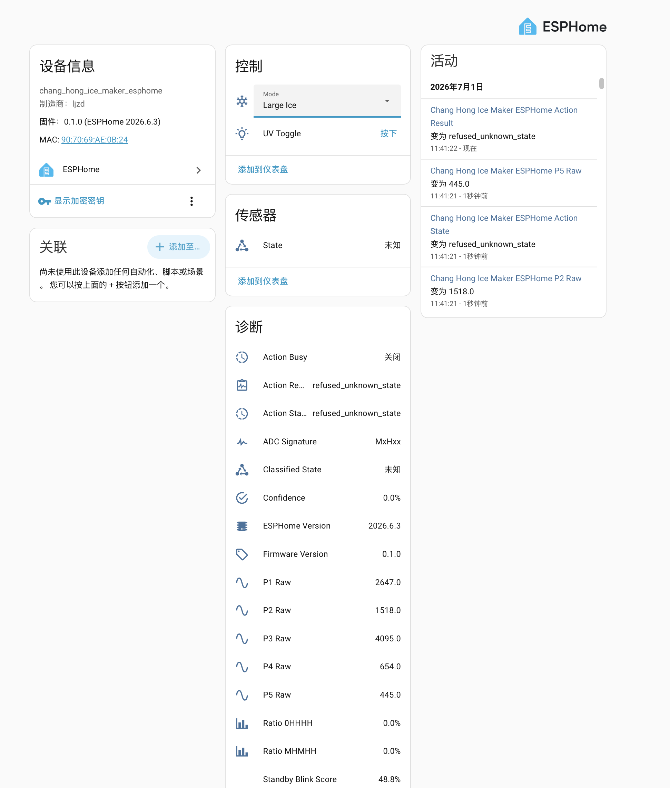

# ChangHongIceMakerESPHome

<p align="center">
  
</p>

这是一个用于把长虹制冰机接入 Home Assistant 的 ESPHome 固件项目。硬件基于 ESP32-C3，接入制冰机原控制面板的 5 根信号线，实现远程查看工作状态、切换开关机/大小冰、触发 UV 杀菌按键。

本项目使用已经实测可行的直连 GPIO 方案。它适合当前这台机器的改造和调试，但不是通用安全接口方案；正式长期使用时，建议给每根信号线增加限流、电平钳位或隔离前端。

## 作者与项目信息

- 作者/维护者：[Ljzd-PRO](https://github.com/Ljzd-PRO) `<me@ljzd.link>`
- ESPHome 项目标识：`ljzd-pro.chang_hong_ice_maker_esphome`

ESPHome 的 `project.name` 字段使用 `author_name.project_name` 形式，并会通过 logger、mDNS 和 Native API 的 device_info 暴露。完整作者联系方式保存在本 README、ESPHome YAML 注释和本地 external component 源码注释中。

## 面板与电路板照片


## 功能

- 在 Home Assistant 中提供一个三档模式选择：
  - `Off`
  - `Small Ice`
  - `Large Ice`
- 提供 `UV Toggle` 按钮，用于模拟长按“选择”键开启或关闭 UV 杀菌。
- 自动识别面板状态：
  - `standby`
  - `running_small`
  - `running_large`
  - `starting`
  - `stopping`
  - `unknown`
- 提供调试实体：ADC 签名、置信度、动作状态、P1-P5 原始读数等。
- 提供固件版本和 ESPHome 编译版本诊断实体，方便 OTA 后确认设备运行的固件。
- 支持 ESPHome Native API、OTA、串口日志、Fallback AP 配网和 BLE Improv 配网。

## 工作方式简述

制冰机原面板是 5 根线加若干 LED/按键的扫描电路。ESP32-C3 平时只把 P1-P5 作为高阻输入读取，通过 ADC 签名判断当前是待机、小冰运行还是大冰运行。

远程控制时，固件会短暂把对应 GPIO 切换为开漏低电平，模拟原面板按键：

```text
开关短按:  GPIO1 低电平约 100 ms
选择短按:  GPIO2 低电平约 80 ms
UV 长按:   GPIO2 低电平约 5000 ms
```

动作结束后，所有 GPIO 会恢复为输入状态。固件内部有 busy 状态和冷却时间，用于避免 Home Assistant 快速连续点击造成重入。

## 硬件准备

推荐硬件：

- ESP32-C3 Super Mini 或兼容 ESP32-C3 开发板
- USB-C 供电线或稳定 5V USB 电源
- 细导线若干
- 万用表
- 绝缘胶带、热缩管或其它绝缘固定材料

接线前请先确认制冰机已经断电，并等待至少 30 秒。

## 接线

面板信号线连接如下：

```text
P1 -> GPIO0
P2 -> GPIO1
P3 -> GPIO2
P4 -> GPIO3
P5 -> GPIO4
```

注意事项：

- 不连接制冰机 GND 到 ESP32-C3 GND。
- ESP32-C3 由自己的 USB 口供电，不从面板取电。
- 不要在制冰机通电时插拔 P1-P5。
- 不要让裸线、焊点或 ESP32-C3 背面接触制冰机金属件。
- 如果接上 P3/GPIO2 后 ESP32-C3 无法启动，可考虑把 P3 改接到 GPIO5，并同步修改固件代码里的引脚映射。

当前固件使用直连 GPIO。实测面板线上可能出现高于 3.3V 的电压，ESP32-C3 有损坏风险。更稳妥的长期方案是在每根 P 线与 GPIO 之间增加串联电阻和钳位保护，或使用隔离/模拟开关方案。

## 刷机

建议先在 ESP32-C3 未连接制冰机时完成刷机。

安装 ESPHome：

```sh
python3 -m venv .venv-esphome
.venv-esphome/bin/pip install esphome
```

复制并编辑密钥文件：

```sh
cp chang_hong_ice_maker_esphome/secrets.example.yaml chang_hong_ice_maker_esphome/secrets.yaml
```

`secrets.yaml` 示例：

```yaml
wifi_ssid: "YOUR_WIFI_SSID"
wifi_password: "YOUR_WIFI_PASSWORD"
fallback_ap_password: "CHANGE_ME_1234"
api_encryption_key: "REPLACE_WITH_BASE64_32_BYTE_KEY"
ota_password: "REPLACE_WITH_RANDOM_OTA_PASSWORD"
```

可以用下面的命令生成 API encryption key：

```sh
openssl rand -base64 32
```

检查配置并编译：

```sh
.venv-esphome/bin/esphome config chang_hong_ice_maker_esphome/chang-hong-ice-maker-esphome.yaml
.venv-esphome/bin/esphome compile chang_hong_ice_maker_esphome/chang-hong-ice-maker-esphome.yaml
```

查找串口：

```sh
ls -1 /dev/cu.usb* /dev/tty.usb*
```

首次刷机：

```sh
.venv-esphome/bin/esphome run chang_hong_ice_maker_esphome/chang-hong-ice-maker-esphome.yaml --device /dev/cu.usbmodemXXXX
```

之后可通过 OTA 更新：

```sh
.venv-esphome/bin/esphome upload chang_hong_ice_maker_esphome/chang-hong-ice-maker-esphome.yaml --device chang-hong-ice-maker-esphome.local
```

如果 mDNS 不稳定，也可以把 `--device` 换成 ESP32-C3 的 IP 地址。

## 配网

固件支持三种方式。

第一种：在 `secrets.yaml` 里写入 Wi-Fi SSID 和密码后刷机。设备启动后会直接连接该 Wi-Fi。

第二种：Fallback AP 配网。

1. 给 ESP32-C3 上电。
2. 如果设备无法连上已有 Wi-Fi，等待约 90 秒。
3. 用手机或电脑连接 Wi-Fi：`ChangHongIceMakerESPHome AP`。
4. 打开 `http://192.168.4.1/`。
5. 输入家庭 Wi-Fi SSID 和密码。

第三种：BLE Improv 配网。

1. 给 ESP32-C3 上电。
2. 如果设备无法连上已有 Wi-Fi，等待约 90 秒。
3. 使用支持 Web Bluetooth 的 Chrome 或 Edge 打开 `https://www.improv-wifi.com/`。
4. 选择名为 `chang-hong-ice-maker-esphome` 的蓝牙设备。
5. 输入家庭 Wi-Fi SSID 和密码。

蓝牙只用于配网，不用于日常控制。日常控制通过 Wi-Fi 上的 ESPHome Native API 完成。

固件会把成功连接的 Wi-Fi 凭据保存到固定存储位置，避免后续 OTA 因配置哈希变化丢失配网信息。`secrets.yaml` 是本地文件，已被 Git 忽略，不要提交真实密码。

## 添加到 Home Assistant

1. 确认 ESP32-C3 和 Home Assistant 在同一局域网。
2. 在 Home Assistant 中进入 `Settings -> Devices & services`。
3. 如果自动发现了 `Chang Hong Ice Maker ESPHome`，直接添加。
4. 如果没有自动发现，点击 `Add Integration`，选择 `ESPHome`。
5. Host 填：
   - `chang-hong-ice-maker-esphome.local`，或
   - ESP32-C3 的 IP 地址。
6. 按提示输入 `secrets.yaml` 中的 `api_encryption_key`。

添加成功后，Home Assistant 中的设备名为：

```text
Chang Hong Ice Maker ESPHome
```

常用实体：

```text
select.chang_hong_ice_maker_esphome_mode
button.chang_hong_ice_maker_esphome_uv_toggle
sensor.chang_hong_ice_maker_esphome_state
binary_sensor.chang_hong_ice_maker_esphome_action_busy
sensor.chang_hong_ice_maker_esphome_action_state
sensor.chang_hong_ice_maker_esphome_action_result
sensor.chang_hong_ice_maker_esphome_firmware_version
sensor.chang_hong_ice_maker_esphome_esphome_version
```

诊断实体包括 ADC 签名、置信度、待机闪烁分数、P1-P5 原始 ADC 值等。

如果曾经用旧固件添加过同一块 ESP32-C3，Home Assistant 可能会保留旧 entity_id。此时可以在 HA 的实体设置中手动改名，或删除旧 ESPHome 设备后重新添加。

<details>
<summary>展开查看 Home Assistant 设备页面截图</summary>



</details>

## 使用方式

### 开机运行

在 Home Assistant 中把 `Mode` 设为：

```text
Small Ice
```

或：

```text
Large Ice
```

如果当前制冰机处于待机，固件会先模拟“开关”短按启动机器，然后根据目标模式补一次“选择”短按。

### 切换大小冰

制冰机运行时，把 `Mode` 在 `Small Ice` 和 `Large Ice` 之间切换即可。

### 关机待机

把 `Mode` 设为：

```text
Off
```

固件会模拟“开关”短按，使制冰机回到待机。

### UV 杀菌

点击：

```text
UV Toggle
```

固件会模拟长按“选择”键约 5 秒。原面板没有可靠的 UV 状态反馈，所以这里提供的是按钮，不是开关。开启或关闭后的真实 UV 状态需要以制冰机自身表现为准。

## 安装后检查

首次接入制冰机后，建议按下面顺序检查：

1. 制冰机断电，接好 P1-P5。
2. ESP32-C3 上电并连接 Wi-Fi。
3. 制冰机上电进入待机。
4. 等待 20-35 秒，确认 `State` 变为 `standby`。
5. 在 HA 中选择 `Large Ice` 或 `Small Ice`，确认制冰机启动。
6. 切换大小冰，确认面板指示灯和 HA 状态一致。
7. 选择 `Off`，确认制冰机回到待机。
8. 点击 `UV Toggle`，确认长按动作能触发制冰机的 UV 功能。

如果状态一直是 `unknown`，优先检查 P1-P5 是否接反、P3/GPIO2 是否影响启动、制冰机是否处于异常状态，以及 ESP32-C3 是否仍能稳定连接 Wi-Fi。

## 串口调试

串口日志参数：

```text
921600 baud
DEBUG level
```

查看日志：

```sh
.venv-esphome/bin/esphome logs chang_hong_ice_maker_esphome/chang-hong-ice-maker-esphome.yaml --device /dev/cu.usbmodemXXXX
```

也可以通过网络查看：

```sh
.venv-esphome/bin/esphome logs chang_hong_ice_maker_esphome/chang-hong-ice-maker-esphome.yaml --device chang-hong-ice-maker-esphome.local
```

常见调试字段：

```text
state                 当前对外状态
classifier            内部分类结果
sig                   当前 ADC 签名
ratio_0HHHH           大冰运行签名占比
ratio_MHMHH           待机/小冰签名占比
blink                 待机慢闪评分
action_state          当前动作状态
action_result         最近动作结果
```

## 限制

- 当前直连 GPIO 方案存在电气风险，ESP32-C3 GPIO 可能承受超过 3.3V 的面板电压。
- 本项目不提供“缺水”和“冰满”的可靠 Home Assistant 状态实体。
- UV 没有面板反馈，因此只提供按钮，不提供真实状态开关。
- 待机和小冰运行的区分依赖电源灯慢闪特征，刚上电或刚切换后的几秒内可能显示 `unknown`。
- 如果 Home Assistant 快速连续发送冲突命令，固件会拒绝部分命令，以保护原面板扫描逻辑。

## 附录：面板电路图与 PCB 走线图

<details>
<summary>展开查看逆向分析用电路图</summary>

这些图主要服务于维修、二次开发和验证接线。普通 Home Assistant 用户通常只需要阅读前面的接线与使用说明。

第一张是“网表展开图”，把每条已确认支路单独展开，便于核对 `P1-P5` 与 LED、按键、电阻的连接：


第二张是“单张互连等效原理图”，只保留一套 `P1-P5` 公共节点，便于理解 5 根线如何复用为 LED 驱动和按键扫描：


第三张是“PCB 走线示意图”，按背面铜箔视角近似复原，正面元件以镜像投影方式标注。它不是可直接投产的 Gerber 文件：


</details>
